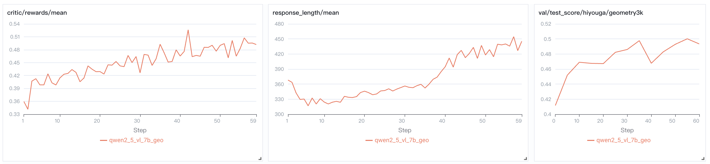

# EasyR1: An Efficient, Scalable, Multi-Modality RL Training Framework

This project is a clean fork of the original [veRL](https://github.com/volcengine/verl) project to support vision language models, we thank all the authors for providing such a high-performance RL training framework.

EasyR1 is efficient and scalable due to the design of **[HybirdEngine](https://arxiv.org/abs/2409.19256)** and the latest release of **[vLLM](https://github.com/vllm-project/vllm)**'s SPMD mode.

## Features

- Supported models
  - Qwen2/Qwen2.5 language models
  - Qwen2/Qwen2.5-VL vision language models
  - DeepSeek-R1 distill models

- Supported algorithms
  - GRPO
  - others RL algorithms (comming soon)

- Supported datasets
  - Any text, vision-text dataset in a [specific format](#custom-dataset).

## Requirements

### Software Requirements

- Python 3.9+
- Pytorch 2.4.0+
- Transformers 4.49.0+
- flash-attn
- vLLM 0.7.3+

We provide a [Dockerfile](./Dockerfile) to easily build environments.

### Hardware Requirements

At least **8*80GB VRAM** is needed to train a 7B model. If you have less computation resource, please consider using smaller (1.5B, 3B) models.

## Tutorial: Run Qwen2.5-VL GRPO on [Geometry3K](https://huggingface.co/datasets/hiyouga/geometry3k) Dataset in Just 3 Steps



### Installation

```bash
git clone https://github.com/hiyouga/EasyR1.git
cd EasyR1
pip install -e .
pip install git+https://github.com/hiyouga/MathRuler.git
```

### GRPO Training

```bash
bash examples/run_qwen2_5_vl_7b_geo.sh
```

### Merge Checkpoint in Hugging Face Format

```bash
python3 scripts/model_merger.py --local_dir path_to_your_last_actor_checkpoint
```

## Custom Dataset

The dataset should strictly follow the example data format.

- Text dataset: https://huggingface.co/datasets/hiyouga/math12k
    - Required columns: problem, answer

- Vision-text dataset: https://huggingface.co/datasets/hiyouga/geometry3k
    - Required columns: images, problem, answer

## TODO

- Support PPO, Remax, Reinforce++ and RLOO for VLMs.
- Support padding-free training for VLMs.
- Support ulysses parallelism for VLMs.
- Support more VLM architectures.

### Known bugs

These features are temporarily disabled for now, we plan to fix them one-by-one in the future updates.

- Vision language models are not compatible with padding-free training and ulysses parallelism yet.
- Vision language models are not compatible with `enable_chunked_prefill` unless [vLLM v1](https://blog.vllm.ai/2025/01/27/v1-alpha-release.html) is supported.

## Discussion Group

👋 Join our [WeChat group](assets/wechat.jpg).

## Citation

Core contributors: [Yaowei Zheng](https://github.com/hiyouga), [Junting Lu](https://github.com/AL-377), [Shenzhi Wang](https://github.com/Shenzhi-Wang) and Yuwen Xiong

We also thank Guangming Sheng and Chi Zhang for helpful discussions.

```bibtex
@misc{zheng2025easyr1,
  title = {EasyR1: An Efficient, Scalable, Multi-Modality RL Training Framework},
  author = {Yaowei Zheng, Junting Lu, Shenzhi Wang, Yuwen Xiong},
  howpublished = {\url{https://github.com/hiyouga/EasyR1}},
  year = {2025}
}
```

We recommend to also cite the original work.

```bibtex
@article{sheng2024hybridflow,
  title   = {HybridFlow: A Flexible and Efficient RLHF Framework},
  author  = {Guangming Sheng and Chi Zhang and Zilingfeng Ye and Xibin Wu and Wang Zhang and Ru Zhang and Yanghua Peng and Haibin Lin and Chuan Wu},
  year    = {2024},
  journal = {arXiv preprint arXiv: 2409.19256}
}
```
